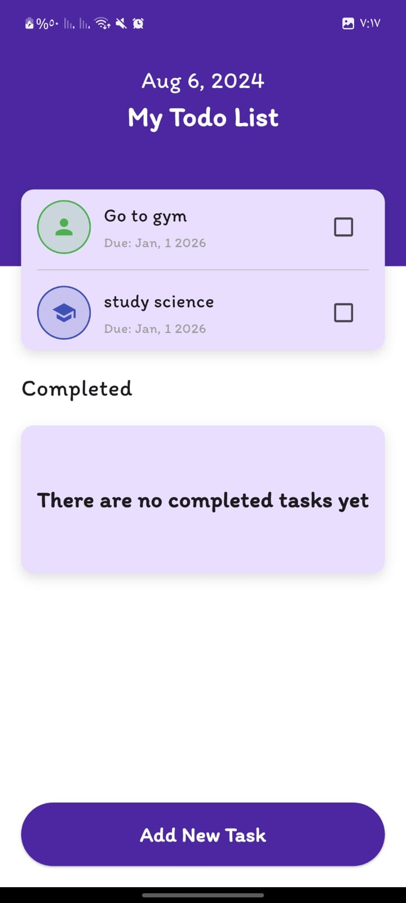
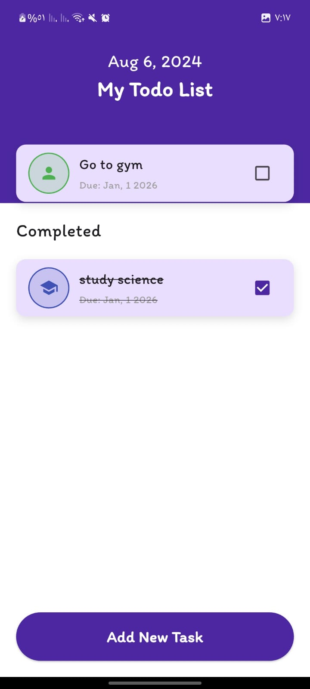
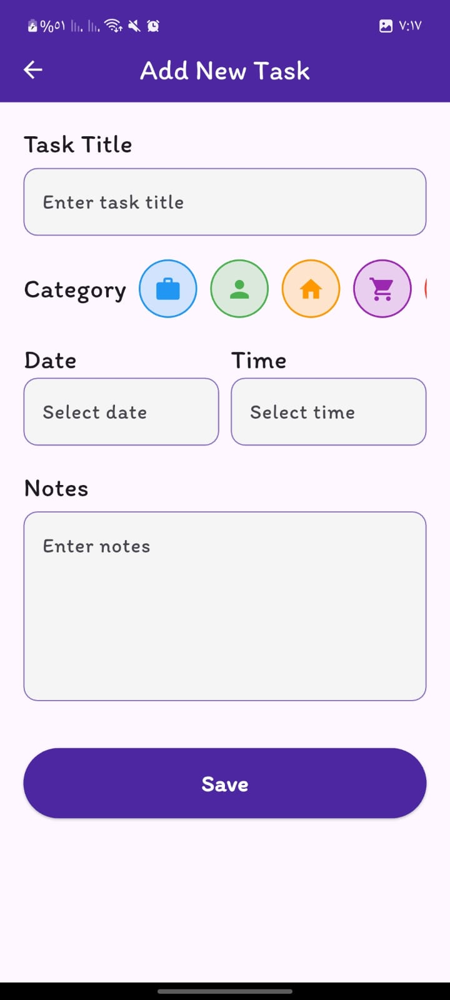
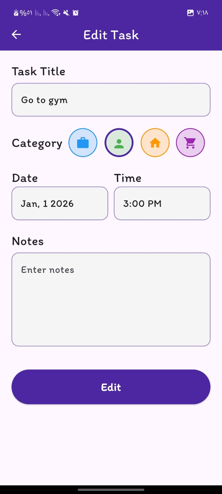
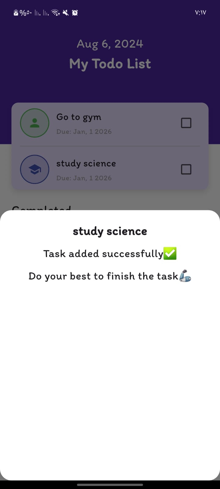

A powerful and beautiful Todo Application built with Flutter, designed to help you stay organized and boost your productivity.

## 🚀 Problem & Solution

**The Problem:** Keeping track of daily tasks, appointments, and random thoughts can be chaotic. Users need a reliable tool that is fast, works offline, and allows for detailed organization without being overwhelmed by complexity.

**The Solution:** This application provides a streamlined interface for managing tasks efficiently. It leverages a local database for instant access and persistence, ensuring your data is always available regardless of internet connection.
*   **Structured Organization:** Categorize tasks (Work, Personal, Learning, etc.) to keep different aspects of life separate.
*   **Reliable Scheduling:** Set specific dates and times for tasks to never miss a deadline.
*   **High Performance:** Built with ObjectBox, one of the fastest local databases available for Flutter.

## Features

*   **Create Tasks:** Add new tasks with titles, detailed notes, dates, and times.
*   **Categorization:** Assign categories (e.g., Work, Home, Personal) to tasks for better filtering and visualization.
*   **Task Management:** Mark tasks as completed or edit details as needed.
*   **Local Persistence:** All data is stored locally using **ObjectBox**, ensuring privacy and offline capability.
*   **Responsive Design:** The UI adapts to different screen sizes using `flutter_screenutil`.
*   **Custom Theming:** Uses Google Fonts (Itim) for a friendly and modern aesthetic.

## 📸 Screenshots


| Home Screen | Completed Tasks | Add Task |
|:---:|:---:|:---:|
|  |  |  |

| Edit Task | Bottom Sheet |
|:---:|:---:|
|  |  |

## 🛠️ Tools & Technologies

This project utilizes a modern and robust tech stack:

*   **Framework:** [Flutter](https://flutter.dev/) (SDK > 3.10.1)
*   **Language:** [Dart](https://dart.dev/)
*   **Architecture:** Clean Architecture (Separation of concerns)
*   **State Management:** [Riverpod](https://riverpod.dev/) (Hooks Riverpod)
*   **Database:** [ObjectBox](https://objectbox.io/) (High-performance NoSQL database)
*   **Code Generation:** 
    *   [Freezed](https://pub.dev/packages/freezed) (Immutable data classes)
    *   [Riverpod Generator](https://pub.dev/packages/riverpod_generator)
*   **UI & UX:**
    *   [flutter_screenutil](https://pub.dev/packages/flutter_screenutil) (Responsive layout)
    *   [flutter_animate](https://pub.dev/packages/flutter_animate) (Smooth animations)
    *   [google_fonts](https://pub.dev/packages/google_fonts) (Typography)

## 🏗️ Architecture Overview

The project is structured using **Clean Architecture** to ensure scalable and testable code:

```
lib/
├── core/                # Shared utilities, services (ObjectBox), and config
├── features/
│   └── home/            # Main Todo Feature
│       ├── data/        # Data Sources & Models (ObjectBox entities)
│       ├── domain/      # Business Entities & Logic (TaskEntity)
│       └── presentation/# UI Layer (Pages, Widgets, Providers)
└── main.dart            # Entry point
```

## 🚀 How to Run

Follow these steps to get the project running on your local machine.

### Prerequisites
*   [Flutter SDK](https://docs.flutter.dev/get-started/install) installed.
*   A physical device or emulator (Android/iOS).

### Installation

1.  **Clone the Repository:**
    ```bash
    git clone https://github.com/Ahmed-Mamdouh-Elattar/todo_app.git
    cd todo_app
    ```

2.  **Install Dependencies:**
    ```bash
    flutter pub get
    ```

3.  **Run Code Generator (Optional but recommended):**
    If you plan to modify the code, ensure generated files are up-to-date:
    ```bash
    dart run build_runner build -d
    ```

4.  **Run the App:**
    ```bash
    flutter run
    ```

## 📬 Contact

For any questions or feedback, feel free to reach out!
